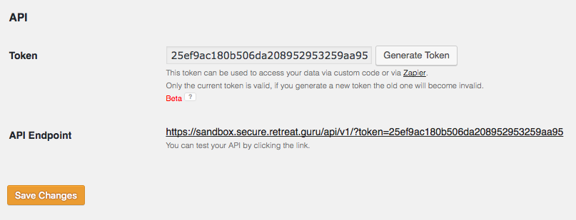

Booking Guru API v1
===================

Welcome to the Booking Guru API, we're glad you could make it. Let's poke around a bit.

And just in case you have no idea where you are, [Booking Guru](http://bookingsoftware.guru)
is a software package for spiritual retreat centers to manage programs, registrations, finances
and everything in between.

## Security token

The first thing you'll need is the security token for your installation. Go to the Reg. Settings
on your install, select the API tab and grab the token that appears there.



If there isn't a token there yet, hit *Generate Token*, then *Save changes* and then copy the token.

Set a couple of environment variables so it's easier to run the samples:

```
$ export RGDOMAIN=<domain>
$ export RGTOKEN=<token>
```

The `<domain>` is your install's domain, and `<token>` is the token you just got from the admin UI.

Lets take a look at some data.

## Curl examples

Get programs:

```
$ curl "https://$RGDOMAIN/api/v1/programs?token=$RGTOKEN"
```

Get registations:

```
$ curl "https://$RGDOMAIN/api/v1/registrations?token=$RGTOKEN"
```

Get transactions:

```
$ curl "https://$RGDOMAIN/api/v1/transactions?token=$RGTOKEN"
```

## More examples

More examples in different programming languages are available in [examples/](https://github.com/retreatguru/rbg-api/tree/master/examples).

## API Reference

Following is the reference for the requests you can currently do against the API.

*Notes:*

1. All values with the `date` type are in `YYYY-MM-DD` format, all values with the `date-time` type are in the `YYYY-MM-DDTHH:MM:SS` format.
   The special value `today` can also be used with any date argument.

2. If a parameters can take multiple values (the `id` parameter usually does), provide multiple values separated by commas without spaces.

---

### GET /programs
**Get program info**

Retrieves information about programs, their dates and and categories.

#### Parameters

***`token: string (required)`***

Security token

***`id: [integer]`***

Get programs with a specific id or list of ids. To get multiple objects, provide a comma separated list of values.

***`limit: integer`***

Limit number of return values. The default limit is 20. Pass `limit=0` To get all the objects without
limits, but please use this with caution to not overload our servers.

***`page: integer`***

Get further pages of results. By default the first `limit` results is returned, to get further results
pass higher values to `page`. When a page is higher than available data the request will return an empty JSON array.

***`lang: string`***

Get the content for a particular language. The language values are two-letter identifiers from
[ISO 639-1](https://www.loc.gov/standards/iso639-2/php/code_list.php).
Only the languages that are enabled for your install will work. The default language is `en` (English).

***`category: [string]`***

Get all the programs that belong to this category or categories.

***`on_date: date`***

Get all the programs that occur on this date (start on and before it and end on or after it).

***`min_date: date`***

Get all the programs that start on or after this date.

***`max_date: date`***

Get all the programs that end on or after this date.

***`teacher_id: integer`***

Get all the programs for the teacher

***`include: [string]`***

Include additional data in the response. The valid values are:

- `teachers` to include [Teacher](#teacher) objects

#### Responses

| Code | Description | Schema |
| ---- | ----------- | ------ |
200 | An array of programs | [ [Program](#program) ] 
400 | An error | [Error](#error) 

---

### GET /teachers
**Get teacher info**

Retrieves information about teachers and their descriptions.

#### Parameters

***`token: string (required)`***

Security token

***`id: [integer]`***

Get programs with a specific id or list of ids. To get multiple objects, provide a comma separated list of values.

***`limit: integer`***

Limit number of return values. The default limit is 20. Pass `limit=0` To get all the objects without
limits, but please use this with caution to not overload our servers.

***`page: integer`***

Get further pages of results. By default the first `limit` results is returned, to get further results
pass higher values to `page`. When a page is higher than available data the request will return an empty JSON array.

***`lang: string`***

Get the content for a particular language. The language values are two-letter identifiers from
[ISO 639-1](https://www.loc.gov/standards/iso639-2/php/code_list.php).
Only the languages that are enabled for your install will work. The default language is `en` (English).

***`program_id: [integer]`***

Get teachers for a specific program or programs (for multiple programs supply a comma separated list of ids).

#### Responses

| Code | Description | Schema |
| ---- | ----------- | ------ |
200 | An array of teachers | [ [Teacher](#teacher) ] 
400 | An error | [Error](#error) 

---

### GET /registrations
**Get registration info**

Retrieves registration details including names, emails and programs people have registered to. Registrations are always sorted
in reverse chronological order with the newest registrations at the top or the result list.

#### Parameters

***`token: string (required)`***

Security token

***`id: [integer]`***

Get programs with a specific id or list of ids. To get multiple objects, provide a comma separated list of values.

***`limit: integer`***

Limit number of return values. The default limit is 20. Pass `limit=0` To get all the objects without
limits, but please use this with caution to not overload our servers.

***`page: integer`***

Get further pages of results. By default the first `limit` results is returned, to get further results
pass higher values to `page`. When a page is higher than available data the request will return an empty JSON array.

***`lang: string`***

Get the content for a particular language. The language values are two-letter identifiers from
[ISO 639-1](https://www.loc.gov/standards/iso639-2/php/code_list.php).
Only the languages that are enabled for your install will work. The default language is `en` (English).

***`program_id: [integer]`***

Filter registrations for a specific program or programs (for multiple programs supply a comma separated list of ids).

***`min_date: date`***

Get registrations that were submitted on or after `min_date`. Can be combined with `max_date` for a range of dates.

***`max_date: date`***

Get registrations that were submitted on or before `max_date`.

***`min_stay: date`***

Get all registrations for which the registration stay dates are on or after `min_stay`. In particular
this includes registrations that start on `min_stay`, those that start before `min_stay` and end on or after it,
and those that start after `min_stay`. This will not include registrations that end before `min_stay`.

***`max_stay: date`***

Get all registrations for which the registration stay dates are on or before `max_stay`. In particular
this includes registrations that those that start before `max_stay` and end on or after it,
and those that start after `max_stay`. This will not include registrations that start after `max_stay`.

***`include: [string]`***

Include additional data in the response. The valid values are:

- `payments` to include [Payment](#payment) objects
- `items` to include [Item](#item) objects
- `transactions` to include [Transaction](#transaction) objects (both items and payments)

#### Responses

| Code | Description | Schema |
| ---- | ----------- | ------ |
200 | An array of registrations | [ [Registration](#registration) ] 
400 | An error | [Error](#error) 

---

### GET /transactions
**Get transaction info**

Transactions represent the financial details of the registration, including items the guest has purchased, discounts, taxes,
credit card payments, cash payments and any other custom transaction type you may have defined on your install.

Transactions are always sorted in reverse chronological order with the newest transaction at the top or the result list.

#### Parameters

***`token: string (required)`***

Security token

***`id: [integer]`***

Get programs with a specific id or list of ids. To get multiple objects, provide a comma separated list of values.

***`limit: integer`***

Limit number of return values. The default limit is 20. Pass `limit=0` To get all the objects without
limits, but please use this with caution to not overload our servers.

***`page: integer`***

Get further pages of results. By default the first `limit` results is returned, to get further results
pass higher values to `page`. When a page is higher than available data the request will return an empty JSON array.

***`lang: string`***

Get the content for a particular language. The language values are two-letter identifiers from
[ISO 639-1](https://www.loc.gov/standards/iso639-2/php/code_list.php).
Only the languages that are enabled for your install will work. The default language is `en` (English).

***`class: [string]`***

Filter transactions by class. Classes are hard coded and segment transaction into 8 broad categories:

* `item` - an item the guest needs to pay for
* `discount` - a discount the guest has received
* `card-payment` - a credit card payment
* `card-refund` - a credit card refund
* `non-cc-payment` - a non credit card payment (cash, wire transfer, etc)
* `non-cc-refund` - a non credit card refund
* `person-credit` - personal credit was added for the guest
* `person-debit` - personal credit was used for payment

***`program_id: [integer]`***

Filter transactions for a specific program or programs (for multiple programs supply a comma separated list of ids).

***`registration_id: [integer]`***

Filter transactions for a specific registration or registrations.

***`min_date: date`***

Filter transactions that were submitted on or after this date.

***`max_date: date`***

Filter transactions that were submitted on or before this date.

***`category: [string]`***

Filter transactions by category. Categories are user defined and can be very specific.

#### Responses

| Code | Description | Schema |
| ---- | ----------- | ------ |
200 | An array of transactions | [ [Transaction](#transaction) ] 
400 | An error | [Error](#error) 

---

### GET /payments
**Get payment transaction info**

Payment transactions can be credit card transactions entered automatically through the Booking Guru
registration system and entires done manually through the admin interface. Refunds are also represented
here Every payment is also available through the `/transactions` endpoint, but objects received through
this endpoint are filtered for easier use and contain more details that are only relevant for payments.

The `/payments` endpoint accepts the same arguments as the `/transactions` endpoint.

#### Parameters

***`token: string (required)`***

Security token

#### Responses

| Code | Description | Schema |
| ---- | ----------- | ------ |
200 | An array of payments | [ [Payment](#payment) ] 
400 | An error | [Error](#error) 

---

### GET /items
**Get item transaction info**

Item transactions represent anything purchased by a guest and any discount they received. This
includes payment for programs, lodging, meals and any optional items that were set up. Every item
transaction is also available through the `/transactions` endpoint, but objects received here
are filtered for easier use and contain more details that are only relevant for items.

The `/items` endpoint accepts the same arguments as the `/transactions` endpoint.

#### Parameters

***`token: string (required)`***

Security token

#### Responses

| Code | Description | Schema |
| ---- | ----------- | ------ |
200 | An array of items | [ [Item](#item) ] 
400 | An error | [Error](#error) 

---

### GET /leads
**Get leads info**

Leads are created in two cases: (1) when a person enters a waiting list on a program that's fully booked and,
(2) when the Advanced Registration Form is enabled and the user only enters their name and email in the Welcome
section. In the former case the lead type is 'abandoned-reg', in the latter it is 'wait-list'.

#### Parameters

***`token: string (required)`***

Security token

***`id: [integer]`***

Get programs with a specific id or list of ids. To get multiple objects, provide a comma separated list of values.

***`limit: integer`***

Limit number of return values. The default limit is 20. Pass `limit=0` To get all the objects without
limits, but please use this with caution to not overload our servers.

***`page: integer`***

Get further pages of results. By default the first `limit` results is returned, to get further results
pass higher values to `page`. When a page is higher than available data the request will return an empty JSON array.

***`lang: string`***

Get the content for a particular language. The language values are two-letter identifiers from
[ISO 639-1](https://www.loc.gov/standards/iso639-2/php/code_list.php).
Only the languages that are enabled for your install will work. The default language is `en` (English).

***`program_id: integer`***

Filter leads for a specific program or programs (for multiple programs supply a comma separated list of ids).

***`lead_type: string`***

Filter transactions for a lead type.

#### Responses

| Code | Description | Schema |
| ---- | ----------- | ------ |
200 | An array of leads | [ [Lead](#lead) ] 
400 | An error | [Error](#error) 

## Models

### Program

A single program

#### Properties

| Name | Type | Description |
| ---- |----- | ----------- |
| id | integer | internal unique id |
| self_url | url | API URL pointing back to the object |
| name | string | program name |
| content | string | program description |
| start_date | date | program start date |
| end_date | date | program end date |
| registrations_url | url | API URL for program registrations |
| transactions_url | url | API URL for all program transactions (includs payments and items) |
| payments_url | url | API URL for program payments |
| items_url | url | API URL for program items |
| teachers | [string] | teacher names for the program |
| categories | [string] | categories the program belongs to |
| external_code | string | custom program code for linking with other software (entered manually in admin interface) |
| registrations_link | url | URL of public registration page for program |
| program_link | url | URL of public program info page |
| images | [array] | info about program images including urls and sizes |

### Teacher

A single teacher

#### Properties

| Name | Type | Description |
| ---- |----- | ----------- |
| id | integer | internal unique id |
| self_url | url | API URL pointing back to the object |
| name | string | teacher name |
| content | string | teacher description |
| programs_url | url | API URL for the teacher's programs |
| images | [array] | info about teacher images including urls and sizes |

### Registration

A single registration by a guest to a program.

#### Properties

| Name | Type | Description |
| ---- |----- | ----------- |
| id | integer | internal unique id |
| self_url | url | API URL pointing back to the object |
| submitted | date-time | time the registration was submitted |
| start_date | date | the day the guest's stay starts |
| end_date | date | the day the guest's stay ends |
| status | string | registration status (reserved, pending, need-approval, unconfirmed, cancelled, arrived, checked-out, duplicate) |
| first_name | string | guest's first name |
| last_name | string | guest's last name |
| full_name | string | guest's full name |
| email | email | guest's email address |
| program | string | name of program the registration is for |
| program_url | url | URL for API representation of program |
| program_categories | [string] | categories for the program |
| transactions_url | url | API URL for all registration's transactions |
| payments_url | url | API URL for registration's item transactions |
| items_url | url | API URL for registration's payment transactions |
| optional_items | [string] | optional items (add-ons) selected for the registration |
| room | string | name of room guest will be staying in |
| lodging | string | name of lodging type selected |
| nights | integer | total nights of stay |
| grand_total | number | total amount owed for the registration |
| balance_due | number | current balance |
| guest_statement_link | url | link to the (user-facing) guest statement |
| guest_edit_link | url | link to guest edit page (where a guest can update their details) |
| questions | array | an array of all the custom fields that have been configured for the program for which this registration was entered |

### Transaction

A single transaction

#### Properties

| Name | Type | Description |
| ---- |----- | ----------- |
| id | integer | internal unique id |
| self_url | url | API URL pointing back to the object |
| submitted | date-time | exact time when transaction was submitted |
| trans_date | date-time | exact time of the transaction (can be modified manually, as opposed to `submitted`) |
| class | string | coarce grained classification of transactions |
| category | string | fine grained (and user defined) classification of transactions |
| status | string | transaction status (complete, cancel) |
| description | string | transaction description (auto-generated or user-entered in the admin interface) |
| notes | string | notes entered about the transaction by the admin |
| staff_name | string | username of staff member who entered the transaction (if manually entered in the admin interface) |
| program_name | string | name of program for which this transaction was made |
| program_url | url | API URL of program for which this transaction was made |
| person_name | string | name of person on the registration |
| registration_url | url | API URL of connected registration object |
| details_url | url | API URL of detailed payment or item object |
| charge_amount | number | amount that was charged (usually used for purchased items) |
| credit_amount | number | amount that was credited (usually used for payments made) |

### Payment

A single payment or refund transaction. The object includes all fields in Transaction and additional
fields that are only relevant for payments made by the guest.

#### Properties

| Name | Type | Description |
| ---- |----- | ----------- |
| fund_method | string | type of funding |
| merchant_name | string | name of credit card processor (e.g. Paypal) |
| merchant_trans_id | string | transaction id as recorded by credit card processor |
| merchant_profile | string | profile id as recorded by credit card processor |
| merchant_account | string | name of account the transaction was made on |
| merchant_cc_details | string | credit card details as recorded by credit card processor |

### Item

A single item or discount transaction. The object includes all fields in Transaction and additional
fields that are only relevant for items purchased by the guest.

#### Properties

| Name | Type | Description |
| ---- |----- | ----------- |
| is_addon | boolean | is this item an addon (an optional item) selected by the guest |
| discount_amount | string | discount amount (either entered directly or calculated from `discount_percent`) |
| discount_percent | string | discount percentage |
| subtotal | string | total after applying discount, before applying taxes |
| tax_1_info | string | first tax description |
| tax_1_amount | string | first tax amount |
| tax_2_info | string | second tax description |
| tax_2_amount | string | second tax amount |
| grand_total | string | total after applying discount and taxes |

### Lead

A single lead, either an abandoned registration or a waiting list entry.

#### Properties

| Name | Type | Description |
| ---- |----- | ----------- |
| submitted | date-time | exact time when lead was submitted |
| lead_type | string | type of lead (abandoned-reg, wait-list) |
| first_name | string | guest's first name |
| last_name | string | guest's last name |
| full_name | string | guest's full name |
| email | email | guest's email |
| program | string | name of program for which the guest attempted to register |
| program_id | integer | id for the program |
| program_url | url | API URL for the program |
| program_categories | array | categories for the program |
| program_external_code | string | external code for the program (can be set up in the admin under Program / Advanced) |
| language | string | language code in which the registration was completed (i.e. en, fr, etc.) |
| program_link | url | link to program description page |
| registration_link | url | link to registration page |
| questions | array | an array of answers to all custom questions |

### Error

An error returned in case of an incorrect request.

#### Properties

| Name | Type | Description |
| ---- |----- | ----------- |
| message | string | description of error and steps to correct it |
